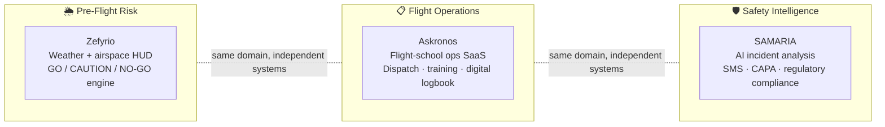

# Cesar Matta

**AI Automation Engineer | Aviation & Aerospace Expert | FAA PPL · ATC · AS9100 | MBA-MIS**

---

30 years of mission-critical aviation operations — Air Traffic Control, aeronautical meteorology, and safety management — now channeled into building AI automation for regulated, high-stakes industries.

Early AI adopter since ChatGPT (2023). Spent years mastering automation tools (Make, Zapier, n8n) before moving into full-stack AI engineering. Building production AI systems at [Nodyt](https://nodyt.com) since 2024.

The intersection I occupy is rare: deep aviation domain expertise + quality systems knowledge (AS9100) + hands-on AI engineering. That combination is what SAMARIA was built from.

---

## What I Build

- Multi-agent LLM systems with Claude (Anthropic API) — routing, RAG, prompt caching, structured outputs
- Automation pipelines: n8n, Make, Zapier connecting ERPs, CRMs, and cloud platforms
- FastAPI backends with async AI processing and PostgreSQL
- Full-stack TypeScript/React frontends
- Compliance-aware AI for regulated environments (aviation, aerospace, quality management)

---

## The aviation safety stack I've built

Three independent, production systems — each shipped solo, each covering a
different layer of the same real-world workflow: decide whether to fly, run
the operation, learn from what goes wrong.

Public case studies for SAMARIA and Askronos below — both live in production,
both proprietary codebases.

---

## Featured Projects

Source for SAMARIA and Askronos is private (client/production systems); each
link below is a public case study documenting architecture, engineering
decisions, and production status — not the code.

### SAMARIA SMS — Aviation Safety Management System
> AI-powered SMS platform that replaces manual incident reporting with an intelligent, regulation-grounded analysis pipeline.

- Analyzes aviation incidents against ICAO / FAA / EASA / AS9100 / Colombia RAC regulatory corpus
- Multi-agent routing with Claude (Anthropic API) + RAG over Pinecone
- Seeded with 189 real 2025 accidents (Aviation Safety Network)
- Immutable audit trail with SHA-256 hash chain (AS9100D Clause 7.5)
- Actor Profile Engine serving multiple operator types (MRO, flight schools, UAS/drone) from one codebase
- CAPA effectiveness state machine + governed Safety Performance Indicators (SPI/SPT)

**Stack:** Python · FastAPI · Claude (Anthropic) · Pinecone · PostgreSQL (RLS) · Google Cloud Run

[Case study](https://github.com/Cesar-Matta/samaria-case-study)

### Askronos — Flight School Operations Platform (Colombia)
> Multi-tenant SaaS covering what generic logbook tools miss: Colombian RAC 61.120/141, SIGA, and MIP dispatch.

- 7-role operating model: Student, Instructor, Dispatcher, Admin, Accounting, Maintenance, Super Admin
- Digital-signature flight records as the legally-binding critical path
- Fleet/maintenance squawk tracking gating dispatch on airworthiness
- Formal role & permission governance across 42 screens, migrated behind a compatibility shim
- Load-tested with k6 against a synthetic dataset before scaling claims

**Stack:** Next.js 16 · React 19 · TypeScript · Prisma · PostgreSQL · Google Cloud Run

[Case study](https://github.com/Cesar-Matta/askronos-case-study)

---

## Other Projects

| Project | Description | Stack |
|---|---|---|
| [Zefyrio Platform](https://github.com/Cesar-Matta/zefyrio-platform) | Aviation Weather & Drone Safety HUD — PWA with METAR, NOTAM, GO/NO-GO AI engine | TypeScript · Supabase · Next.js |
| [TokenPilot](https://github.com/Cesar-Matta/tokenpilot-gpt-5-6) | Portable model-routing policy + optional API gateway for GPT-5.6 Luna/Terra/Sol | Python |
| [ERP System](https://github.com/Cesar-Matta/multi-erp-system-pro) | Full ERP with O2C, P2P, Production Planning, QM & HR — multi-tenant | Next.js · Prisma · TypeScript |
| [Cybersecurity Platform](https://github.com/Cesar-Matta/cybersecurity-platform) | Phishing simulations, risk scoring & n8n automation | Node.js · React · Docker |

---

## Tech Stack

**AI & Automation**
Claude (Anthropic API) · RAG · Multi-Agent Systems · n8n · Make · Zapier · Pinecone · LangChain

**Backend**
Python · FastAPI · Node.js · TypeScript · PostgreSQL · Prisma · SQLAlchemy · Docker

**Frontend**
React · Next.js · TailwindCSS · Vite

**Standards & Quality**
AS9100D · ISO 9001 · ICAO SMS · Safety Management Systems

---

## Aviation Background

- **Colombian Air Force** — 22 years | ATC, Aeronautical Meteorology, Safety Management
- **FAA Private Pilot License** — USA
- **ICAO ATC & Safety Management** certified
- **AS9100D Internal Auditor** — 15+ aerospace organizations at S&G Global Solutions (Miami)
- **Published:** [A21 Aviation Magazine](https://a21.com.mx/author/cesar-augusto-matta-reyes/) | LinkedIn Pulse

**Military Decorations:** Cross of Aeronautical Merit (2015) · Expert Meteorologist in Air Ops (2010) · Marco Fidel Suarez Military Medal (2008)

---

## Education & Certifications

- MBA in Management Information Systems — International American University *(Jun 2026)*
- B.S. Systems Engineering — Fundacion Universitaria Maria Cano
- B.S. Aerospace Engineering — Nueva Granada Military University
- Google Gen AI Fundamentals · n8n Workflow Automation L2 · OSHA 30-Hour

---

## Connect

[LinkedIn](https://www.linkedin.com/in/cesarmatta/) | arexatc@gmail.com | +1 (424) 461-3304 | USA (Remote/Hybrid)

---

*Open to AI Automation, AI Engineering, and Aviation AI roles where domain expertise meets cutting-edge implementation.*
